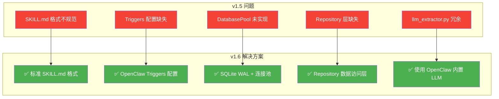
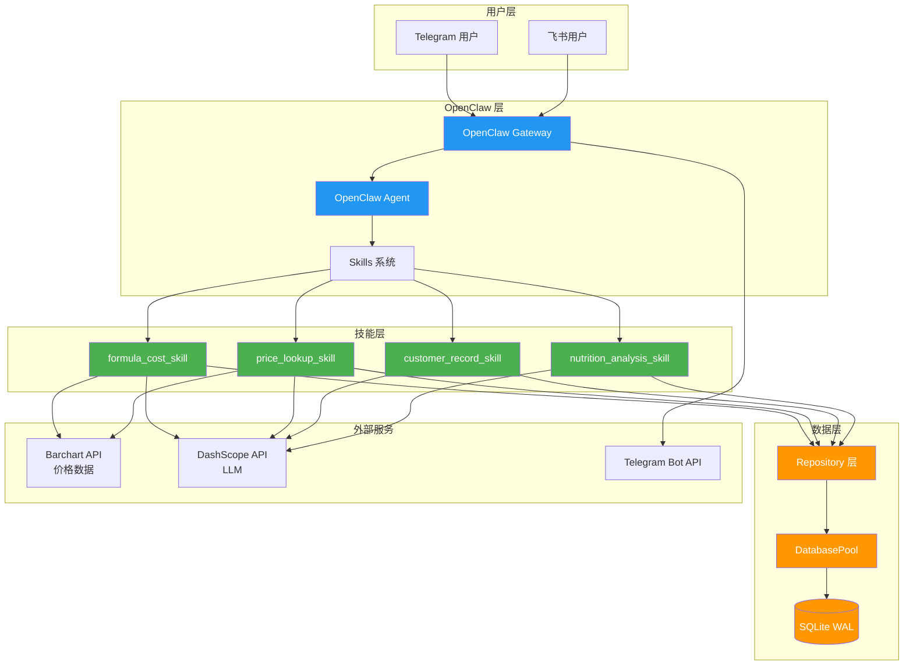

# FeedSales AI MVP v1.6 - 系统架构设计方案

## 文档信息

| 项目 | 内容 |
|------|------|
| **系统名称** | FeedSales AI MVP v1.6 |
| **架构版本** | v1.6 (OpenClaw Skill 标准版) |
| **仓库** | [Gitee: kenny-chenym/feed-sales-ai-mvp](https://gitee.com/kenny-chenym/feed-sales-ai-mvp) |
| **目标分支** | `master` (合并 v1.5) → `v1.6` (新开发) |
| **架构模式** | OpenClaw Skill (SKILL.md 标准) + SQLite |
| **文档日期** | 2026-03-27 |
| **状态** | 📋 设计完成，待开发 |
| **OpenClaw 版本** | 2026.3.24 |

---

## 1. 执行摘要

### 1.1 架构决策背景

基于 v1.5 代码审查和 OpenClaw 3.24 官方文档调查，发现以下关键问题需要 v1.6 解决：

| 问题类别 | 具体问题 | 影响 | 优先级 |
|---------|---------|------|--------|
| **技能格式** | 缺少标准 SKILL.md frontmatter | OpenClaw 无法正确加载技能 | P0 |
| **文档缺失** | 无 ARCHITECTURE_v1.6.md | 开发无指导 | P0 |
| **任务清单滞后** | TASK_LIST 仍为 v1.1 | 工时估算不准 | P1 |
| **代码冗余** | llm_extractor.py 未删除 | 与 OpenClaw 内置功能重复 | P1 |
| **配置缺失** | 无 skill.yaml 配置 | 无法配置环境变量 | P1 |
| **测试不足** | 27 个测试文件但覆盖率未知 | 质量无法保证 | P2 |

### 1.2 v1.6 核心变更



---

## 2. 架构决策总结

### 2.1 已确认的架构决策

| 决策点 | 选项 | 决定 | 理由 |
|--------|------|------|------|
| **技能格式** | skill.yaml vs SKILL.md | ✅ SKILL.md | OpenClaw 3.24 官方标准 |
| **意图分类** | 独立 handler.py vs Triggers | ✅ OpenClaw Triggers | 避免冗余，使用内置能力 |
| **STT 模块** | 自研 vs Telegram 原生 | ✅ Telegram 原生 | Telegram 已支持语音转文本 |
| **LLM 提取** | 自研 vs OpenClaw 内置 | ✅ OpenClaw 内置 | 避免重复造轮子 |
| **数据存储** | JSON vs SQLite | ✅ SQLite WAL | 支持多租户 + 并发安全 |
| **多租户隔离** | 无 vs owner_open_id | ✅ owner_open_id 过滤 | 数据隔离必需 |
| **部署模式** | 自定义 vs OpenClaw Channel | ✅ OpenClaw Channel | 简化配置和维护 |

### 2.2 架构简化对比

#### v1.5 架构（冗余）

```
┌─────────────────────────────────────────┐
│         Telegram Bot API                │
└─────────────────┬───────────────────────┘
                  │
┌─────────────────▼───────────────────────┐
│         OpenClaw Agent                   │
│  ┌─────────┐  ┌─────────┐  ┌─────────┐ │
│  │意图识别 │  │Skill 路由│  │上下文管理│ │
│  └─────────┘  └─────────┘  └─────────┘ │
│         ❌ 冗余层                          │
│  ┌─────────────────────────────────┐    │
│  │ agent/handler.py (15KB)         │    │
│  │ - 独立意图分类器                 │    │
│  │ - 与 OpenClaw triggers 重复      │    │
│  └─────────────────────────────────┘    │
│         ❌ 冗余层                          │
│  ┌─────────────────────────────────┐    │
│  │ skills/formula_cost_skill/      │    │
│  │   - llm_extractor.py            │    │
│  │   - 与 OpenClaw 内置 LLM 重复     │    │
│  └─────────────────────────────────┘    │
└─────────────────┬───────────────────────┘
                  │
    ┌─────────────┼─────────────┐
    ▼             ▼             ▼
┌────────┐  ┌────────┐  ┌────────┐
│  JSON  │  │  JSON  │  │  JSON  │
│ 文件 1  │  │ 文件 2  │  │ 文件 3  │
│ ❌ 单用户│  │ ❌ 并发 │  │ ❌ 无隔离│
└────────┘  └────────┘  └────────┘
```

#### v1.6 架构（简化）

```
┌─────────────────────────────────────────┐
│         Telegram Bot API                │
└─────────────────┬───────────────────────┘
                  │
┌─────────────────▼───────────────────────┐
│         OpenClaw Agent                   │
│  ┌─────────────────────────────────┐    │
│  │ ✅ OpenClaw Triggers            │    │
│  │   - 意图路由 (内置)              │    │
│  │   - 无需独立 handler.py          │    │
│  └─────────────────────────────────┘    │
│  ┌─────────────────────────────────┐    │
│  │ ✅ Standard Skills (SKILL.md)   │    │
│  │   - formula_cost_skill/         │    │
│  │   - price_lookup_skill/         │    │
│  │   - customer_record_skill/      │    │
│  │   - 标准 frontmatter + triggers  │    │
│  └─────────────────────────────────┘    │
│  ┌─────────────────────────────────┐    │
│  │ ✅ OpenClaw Built-in LLM        │    │
│  │   - 无需 llm_extractor.py        │    │
│  │   - 使用 OpenClaw 标准接口        │    │
│  └─────────────────────────────────┘    │
└─────────────────┬───────────────────────┘
                  │
                  ▼
┌─────────────────────────────────────────┐
│      SQLite Database (WAL Mode)         │
│  ┌─────────────────────────────────┐    │
│  │ ✅ owner_open_id 多租户隔离      │    │
│  │ ✅ DatabasePool 连接池           │    │
│  │ ✅ Repository 数据访问层         │    │
│  └─────────────────────────────────┘    │
└─────────────────────────────────────────┘
```

---

## 3. 系统架构详述

### 3.1 整体架构图



### 3.2 技能目录结构（OpenClaw 3.24 标准）

```
feed-sales-ai-mvp/
├── skills/                          # OpenClaw 工作区技能
│   ├── formula_cost_skill/
│   │   ├── SKILL.md                # ✅ 必需：技能定义
│   │   ├── skill.py                # ✅ 必需：技能实现
│   │   ├── tests/
│   │   │   └── test_formula_cost.py
│   │   └── references/
│   │       └── formula_templates.md
│   │
│   ├── price_lookup_skill/
│   │   ├── SKILL.md
│   │   ├── skill.py
│   │   └── tests/
│   │       └── test_price_lookup.py
│   │
│   ├── customer_record_skill/
│   │   ├── SKILL.md
│   │   ├── skill.py
│   │   └── tests/
│   │       └── test_customer_record.py
│   │
│   └── nutrition_analysis_skill/
│       ├── SKILL.md
│       ├── skill.py
│       └── tests/
│           └── test_nutrition_analysis.py
│
├── src/                             # 核心业务逻辑
│   ├── database/
│   │   ├── __init__.py
│   │   ├── pool.py                 # ✅ DatabasePool 连接池
│   │   ├── schema.sql              # ✅ SQLite Schema
│   │   └── repository.py           # ✅ Repository 层
│   │
│   ├── modules/
│   │   ├── __init__.py
│   │   ├── formula_calc.py         # 配方计算引擎
│   │   ├── price_fetcher.py        # 价格获取模块
│   │   ├── intent_classifier.py    # 意图分类（可选，OpenClaw 已提供）
│   │   └── error_handler.py        # 全局错误处理
│   │
│   └── integrations/
│       ├── __init__.py
│       ├── barchart_api.py         # Barchart API 集成
│       └── telegram_bot.py         # Telegram Bot（可选，OpenClaw 已提供）
│
├── config/                          # 配置文件
│   ├── settings.json               # 应用配置
│   └── price_sources.json          # 价格数据源配置
│
├── data/                            # 数据文件
│   ├── feed_sales.db               # SQLite 数据库
│   ├── feed_sales.db-wal           # WAL 文件
│   ├── feed_sales.db-shm           # SHM 文件
│   └── *.json                      # 历史 JSON 数据（迁移用）
│
├── docs/                            # 文档
│   ├── ARCHITECTURE_v1.6.md        # ✅ 本文档
│   ├── DEVELOPMENT_TASKS_v1.6.md   # ✅ 开发任务清单
│   ├── API.md                      # ❌ 缺失：API 文档
│   ├── DEPLOYMENT.md               # ❌ 缺失：部署手册
│   ├── USER_GUIDE.md               # ❌ 缺失：用户手册
│   └── CHANGELOG.md                # ❌ 缺失：变更记录
│
├── tests/                           # 测试
│   ├── unit/                       # 单元测试
│   ├── integration/                # 集成测试
│   └── e2e/                        # 端到端测试
│
├── scripts/                         # 脚本工具
│   ├── migrate_json_to_sqlite.py   # 数据迁移脚本
│   ├── init_database.py            # 数据库初始化
│   └── start_telegram.py           # Telegram Bot 启动
│
├── .env.example                     # ✅ 环境变量模板
├── requirements.txt                 # ✅ Python 依赖
├── requirements-dev.txt             # ✅ 开发依赖
└── README.md                        # ✅ 项目说明
```

### 3.3 SKILL.md 标准格式（每个技能）

#### 3.3.1 formula_cost_skill/SKILL.md

```markdown
---
name: formula_cost_skill
description: >
  饲料配方成本计算技能。
  当用户询问配方成本、价格计算、多少钱一吨等问题时触发。
  支持保育料、育肥料、母猪料等各阶段饲料配方成本计算。
user-invocable: true
metadata:
  openclaw:
    requires:
      bins: ["python3"]
      config: ["BARCHART_API_KEY", "DASHSCOPE_API_KEY"]
    os: ["linux", "darwin"]
---

# 饲料配方成本计算技能

## 何时使用

当用户请求以下任一场景时使用此技能：
- 询问"这个配方多少钱"
- 询问"配方成本计算"
- 询问"多少钱一吨"
- 询问"保育料成本"、"育肥料成本"
- 询问"配方价格对比"

## 必需输入

- **formula_name**: 配方名称（如"保育料 1 号"）
- **owner_open_id**: 用户标识（从 OpenClaw context 自动获取）
- **stage_type**: 饲养阶段（可选，如"保育"、"育肥"）

## 工作流程

1. **获取配方数据**
   - 调用 `FormulaRepository.get_formula(owner_open_id, formula_name)`
   - 如果配方不存在，询问用户是否创建新配方
   - 如果配方存在，获取配方成分和比例

2. **获取原料价格**
   - 调用 `PriceFetcher.get_current_prices(owner_open_id)`
   - 优先使用 Barchart API 实时价格
   - 如果 API 失败，使用本地缓存价格（最近 7 天）
   - 如果价格缺失，询问用户输入或使用默认价格

3. **计算成本**
   - 调用 `FormulaCalculator.calculate_cost(ingredients, prices)`
   - 计算每吨成本（元/吨）
   - 计算每公斤成本（元/公斤）
   - 计算各成分成本占比

4. **返回结果**
   - 格式化输出：总成本、各成分成本、成本占比
   - 提供成本优化建议（可选）
   - 保存计算历史到数据库

## 输出格式

```json
{
  "formula_name": "保育料 1 号",
  "stage_type": "保育",
  "cost_per_ton": 3500.50,
  "cost_per_kg": 3.50,
  "currency": "CNY",
  "ingredients": [
    {
      "name": "玉米",
      "ratio": 60.0,
      "price": 2800.00,
      "cost": 1680.00,
      "percentage": 48.0
    },
    {
      "name": "豆粕",
      "ratio": 25.0,
      "price": 4200.00,
      "cost": 1050.00,
      "percentage": 30.0
    }
  ],
  "calculation_date": "2026-03-27T10:30:00Z",
  "data_source": "barchart"
}
```

## 错误处理

- **配方不存在**: 返回友好提示，询问是否创建新配方
- **价格获取失败**: 降级到本地缓存，缓存失败则询问用户
- **数据库错误**: 记录错误日志，返回友好提示
- **API 限流**: 启用限流器，等待后重试（最多 3 次）

## 降级策略

- 如果 `owner_open_id` 缺失，降级到 `user_id`
- 如果 Barchart API 不可用，使用本地缓存价格
- 如果 SQLite 数据库不可用，返回错误提示

## 相关技能

- `price_lookup_skill`: 查询原料价格
- `customer_record_skill`: 保存客户配方记录
- `nutrition_analysis_skill`: 分析配方营养成分

## 参考文档

- `{baseDir}/references/formula_templates.md`: 配方模板参考
- `{baseDir}/references/price_sources.md`: 价格数据源说明
```

#### 3.3.2 其他技能 SKILL.md 结构

其他技能（price_lookup_skill, customer_record_skill, nutrition_analysis_skill）遵循相同的 SKILL.md 结构，只需调整：
- `name`: 技能名称
- `description`: 触发描述
- `何时使用`: 场景定义
- `必需输入`: 输入参数
- `工作流程`: 业务逻辑
- `输出格式`: 返回数据结构

---

## 4. 数据库设计

### 4.1 SQLite Schema（WAL 模式）

```sql
-- FeedSales AI v1.6 数据库 Schema
-- 启用 WAL 模式
PRAGMA journal_mode = WAL;
PRAGMA synchronous = NORMAL;
PRAGMA cache_size = 10000;

-- ============================================
-- 用户表
-- ============================================
CREATE TABLE IF NOT EXISTS users (
    open_id TEXT PRIMARY KEY,              -- OpenClaw 用户 ID
    telegram_user_id TEXT UNIQUE,          -- Telegram 用户 ID
    feishu_user_id TEXT UNIQUE,            -- 飞书用户 ID
    created_at DATETIME DEFAULT CURRENT_TIMESTAMP,
    updated_at DATETIME DEFAULT CURRENT_TIMESTAMP
);

-- ============================================
-- 原料价格表（支持多租户隔离）
-- ============================================
CREATE TABLE IF NOT EXISTS ingredient_prices (
    id INTEGER PRIMARY KEY AUTOINCREMENT,
    owner_open_id TEXT NOT NULL,           -- 所有者 ID（NULL = 公共数据）
    ingredient_code TEXT NOT NULL,         -- 原料代码
    ingredient_name TEXT NOT NULL,         -- 原料名称
    price REAL NOT NULL,                   -- 价格
    currency TEXT DEFAULT 'CNY',           -- 货币
    unit TEXT DEFAULT 'ton',               -- 单位
    source TEXT DEFAULT 'barchart',        -- 数据来源
    price_date DATE NOT NULL,              -- 价格日期
    created_at DATETIME DEFAULT CURRENT_TIMESTAMP,
    FOREIGN KEY (owner_open_id) REFERENCES users(open_id),
    UNIQUE(ingredient_code, price_date, owner_open_id)
);

-- 索引优化
CREATE INDEX idx_prices_owner_date ON ingredient_prices(owner_open_id, price_date);
CREATE INDEX idx_prices_code ON ingredient_prices(ingredient_code);

-- ============================================
-- 配方表（支持多租户隔离）
-- ============================================
CREATE TABLE IF NOT EXISTS formulas (
    id INTEGER PRIMARY KEY AUTOINCREMENT,
    owner_open_id TEXT NOT NULL,           -- 所有者 ID
    name TEXT NOT NULL,                    -- 配方名称
    stage_type TEXT NOT NULL,              -- 饲养阶段
    notes TEXT,                            -- 备注
    created_at DATETIME DEFAULT CURRENT_TIMESTAMP,
    updated_at DATETIME DEFAULT CURRENT_TIMESTAMP,
    FOREIGN KEY (owner_open_id) REFERENCES users(open_id),
    UNIQUE(owner_open_id, name)
);

-- 索引优化
CREATE INDEX idx_formulas_owner ON formulas(owner_open_id);
CREATE INDEX idx_formulas_stage ON formulas(stage_type);

-- ============================================
-- 配方成分表
-- ============================================
CREATE TABLE IF NOT EXISTS formula_ingredients (
    id INTEGER PRIMARY KEY AUTOINCREMENT,
    formula_id INTEGER NOT NULL,
    ingredient_name TEXT NOT NULL,         -- 原料名称（展示用）
    ingredient_code TEXT NOT NULL,        -- 原料代码（精确查找键，与 ingredient_prices.ingredient_code 对应）
    ratio_percent REAL NOT NULL CHECK(ratio_percent >= 0 AND ratio_percent <= 100),
    created_at DATETIME DEFAULT CURRENT_TIMESTAMP,
    FOREIGN KEY (formula_id) REFERENCES formulas(id) ON DELETE CASCADE,
    FOREIGN KEY (ingredient_code) REFERENCES ingredient_prices(ingredient_code)
);

-- 索引优化
CREATE INDEX idx_formula_ingredients_formula ON formula_ingredients(formula_id);

-- ============================================
-- 客户数据表（支持多租户隔离）
-- ============================================
CREATE TABLE IF NOT EXISTS customers (
    id INTEGER PRIMARY KEY AUTOINCREMENT,
    owner_open_id TEXT NOT NULL,           -- 所有者 ID
    name TEXT NOT NULL,                    -- 客户姓名
    phone TEXT,                            -- 电话
    address TEXT,                          -- 地址
    animal_type TEXT,                      -- 养殖类型
    scale INTEGER,                         -- 养殖规模
    notes TEXT,
    created_at DATETIME DEFAULT CURRENT_TIMESTAMP,
    updated_at DATETIME DEFAULT CURRENT_TIMESTAMP,
    FOREIGN KEY (owner_open_id) REFERENCES users(open_id)
);

-- 索引优化
CREATE INDEX idx_customers_owner ON customers(owner_open_id);

-- ============================================
-- 计算历史表（支持多租户隔离）
-- ============================================
CREATE TABLE IF NOT EXISTS calculation_history (
    id INTEGER PRIMARY KEY AUTOINCREMENT,
    owner_open_id TEXT NOT NULL,           -- 所有者 ID
    formula_name TEXT NOT NULL,            -- 配方名称
    total_cost REAL NOT NULL,              -- 总成本
    cost_per_ton REAL NOT NULL,            -- 每吨成本
    ingredients_json TEXT NOT NULL,        -- JSON 格式成分
    data_source TEXT DEFAULT 'barchart',   -- 数据来源
    created_at DATETIME DEFAULT CURRENT_TIMESTAMP,
    FOREIGN KEY (owner_open_id) REFERENCES users(open_id)
);

-- 索引优化
CREATE INDEX idx_history_owner ON calculation_history(owner_open_id);
CREATE INDEX idx_history_date ON calculation_history(created_at);
```

### 4.2 DatabasePool 实现

```python
# src/database/pool.py
import sqlite3
import threading
from contextlib import contextmanager
from pathlib import Path

class DatabasePool:
    """SQLite 连接池（WAL 模式）"""
    
    _instance = None
    _lock = threading.Lock()
    
    def __new__(cls, db_path: str):
        if cls._instance is None:
            with cls._lock:
                if cls._instance is None:
                    cls._instance = super().__new__(cls)
                    cls._instance._initialized = False
        return cls._instance
    
    def __init__(self, db_path: str):
        if self._initialized:
            return
        
        self.db_path = Path(db_path)
        self.db_path.parent.mkdir(parents=True, exist_ok=True)
        self._local = threading.local()
        self._init_db()
        self._initialized = True
    
    def _init_db(self):
        """初始化数据库（WAL 模式）"""
        conn = sqlite3.connect(self.db_path)
        cursor = conn.cursor()
        
        # 启用 WAL 模式
        cursor.execute("PRAGMA journal_mode=WAL")
        cursor.execute("PRAGMA synchronous=NORMAL")
        cursor.execute("PRAGMA cache_size=10000")
        cursor.execute("PRAGMA foreign_keys=ON")
        
        # 执行 Schema
        schema_path = Path(__file__).parent / "schema.sql"
        if schema_path.exists():
            with open(schema_path, 'r', encoding='utf-8') as f:
                cursor.executescript(f.read())
        
        conn.commit()
        conn.close()
    
    @contextmanager
    def get_connection(self):
        """获取数据库连接（线程安全）"""
        conn = sqlite3.connect(self.db_path)
        conn.row_factory = sqlite3.Row
        try:
            yield conn
        finally:
            conn.close()
```

### 4.3 Repository 层实现

```python
# src/database/repository.py
from typing import Optional, List, Dict
from .pool import DatabasePool

class FormulaRepository:
    """配方数据访问层"""
    
    def __init__(self, db_pool: DatabasePool):
        self.db_pool = db_pool
    
    def get_formula(self, owner_open_id: str, formula_name: str) -> Optional[Dict]:
        """获取用户专属配方"""
        with self.db_pool.get_connection() as conn:
            cursor = conn.cursor()
            cursor.execute("""
                SELECT f.id, f.name, f.stage_type, f.notes,
                       fi.ingredient_name, fi.ratio_percent
                FROM formulas f
                LEFT JOIN formula_ingredients fi ON f.id = fi.formula_id
                WHERE f.owner_open_id = ? AND f.name = ?
            """, (owner_open_id, formula_name))
            
            rows = cursor.fetchall()
            if not rows:
                return None
            
            # 重组数据
            formula = {
                'id': rows[0]['id'],
                'name': rows[0]['name'],
                'stage_type': rows[0]['stage_type'],
                'notes': rows[0]['notes'],
                'ingredients': []
            }
            for row in rows:
                if row['ingredient_name']:
                    formula['ingredients'].append({
                        'name': row['ingredient_name'],
                        'ratio': row['ratio_percent']
                    })
            return formula
    
    def list_formulas(self, owner_open_id: str) -> List[Dict]:
        """列出用户所有配方"""
        with self.db_pool.get_connection() as conn:
            cursor = conn.cursor()
            cursor.execute("""
                SELECT id, name, stage_type, notes, created_at
                FROM formulas
                WHERE owner_open_id = ?
                ORDER BY created_at DESC
            """, (owner_open_id,))
            
            return [dict(row) for row in cursor.fetchall()]
    
    def create_formula(self, owner_open_id: str, formula_data: Dict) -> int:
        """创建用户配方"""
        with self.db_pool.get_connection() as conn:
            cursor = conn.cursor()
            
            # 插入配方
            cursor.execute("""
                INSERT INTO formulas (owner_open_id, name, stage_type, notes)
                VALUES (?, ?, ?, ?)
            """, (owner_open_id, formula_data['name'], 
                  formula_data['stage_type'], formula_data.get('notes')))
            
            formula_id = cursor.lastrowid
            
            # 插入成分
            for ingredient in formula_data['ingredients']:
                cursor.execute("""
                    INSERT INTO formula_ingredients (formula_id, ingredient_name, ratio_percent)
                    VALUES (?, ?, ?)
                """, (formula_id, ingredient['name'], ingredient['ratio']))
            
            conn.commit()
            return formula_id
    
    def update_formula(self, owner_open_id: str, formula_id: int, 
                      formula_data: Dict) -> bool:
        """更新配方"""
        with self.db_pool.get_connection() as conn:
            cursor = conn.cursor()
            
            # 更新配方
            cursor.execute("""
                UPDATE formulas
                SET name = ?, stage_type = ?, notes = ?,
                    updated_at = CURRENT_TIMESTAMP
                WHERE id = ? AND owner_open_id = ?
            """, (formula_data['name'], formula_data['stage_type'],
                  formula_data.get('notes'), formula_id, owner_open_id))
            
            if cursor.rowcount == 0:
                return False
            
            # 删除旧成分
            cursor.execute("""
                DELETE FROM formula_ingredients WHERE formula_id = ?
            """, (formula_id,))
            
            # 插入新成分
            for ingredient in formula_data['ingredients']:
                cursor.execute("""
                    INSERT INTO formula_ingredients (formula_id, ingredient_name, ratio_percent)
                    VALUES (?, ?, ?)
                """, (formula_id, ingredient['name'], ingredient['ratio']))
            
            conn.commit()
            return cursor.rowcount > 0
    
    def delete_formula(self, owner_open_id: str, formula_id: int) -> bool:
        """删除配方"""
        with self.db_pool.get_connection() as conn:
            cursor = conn.cursor()
            cursor.execute("""
                DELETE FROM formulas
                WHERE id = ? AND owner_open_id = ?
            """, (formula_id, owner_open_id))
            
            conn.commit()
            return cursor.rowcount > 0


class PriceRepository:
    """价格数据访问层"""
    
    def __init__(self, db_pool: DatabasePool):
        self.db_pool = db_pool
    
    def get_latest_price(self, owner_open_id: str, 
                        ingredient_code: str) -> Optional[Dict]:
        """获取最新价格"""
        with self.db_pool.get_connection() as conn:
            cursor = conn.cursor()
            cursor.execute("""
                SELECT id, ingredient_code, ingredient_name, price,
                       currency, unit, source, price_date
                FROM ingredient_prices
                WHERE owner_open_id = ? AND ingredient_code = ?
                ORDER BY price_date DESC
                LIMIT 1
            """, (owner_open_id, ingredient_code))
            
            row = cursor.fetchone()
            return dict(row) if row else None
    
    def get_prices_by_date(self, owner_open_id: str, 
                          price_date: str) -> List[Dict]:
        """获取指定日期的所有价格"""
        with self.db_pool.get_connection() as conn:
            cursor = conn.cursor()
            cursor.execute("""
                SELECT ingredient_code, ingredient_name, price,
                       currency, unit, source
                FROM ingredient_prices
                WHERE owner_open_id = ? AND price_date = ?
                ORDER BY ingredient_name
            """, (owner_open_id, price_date))
            
            return [dict(row) for row in cursor.fetchall()]
    
    def save_price(self, owner_open_id: str, price_data: Dict) -> int:
        """保存价格"""
        with self.db_pool.get_connection() as conn:
            cursor = conn.cursor()
            cursor.execute("""
                INSERT OR REPLACE INTO ingredient_prices
                (owner_open_id, ingredient_code, ingredient_name, price,
                 currency, unit, source, price_date)
                VALUES (?, ?, ?, ?, ?, ?, ?, ?)
            """, (owner_open_id, price_data['ingredient_code'],
                  price_data['ingredient_name'], price_data['price'],
                  price_data.get('currency', 'CNY'),
                  price_data.get('unit', 'ton'),
                  price_data.get('source', 'barchart'),
                  price_data['price_date']))
            
            conn.commit()
            return cursor.lastrowid
```

---

## 5. 开发任务清单

### 5.1 P0 任务（必须完成）

| 任务 ID | 任务名称 | 工作量 | 优先级 | 状态 | 依赖 |
|--------|---------|-------|-------|------|------|
| **T01** | 修复 Git 远程配置 | 0.5h | P0 | ✅ 完成 | 无 |
| **T02** | 删除 `agent/` 目录 | 0.5h | P0 | ✅ 完成 | 无 |
| **T03** | 实现 DatabasePool | 3h | P0 | 📋 待开发 | 无 |
| **T04** | 实现 Repository 层 | 4h | P0 | 📋 待开发 | T03 |
| **T05** | 创建 SQLite Schema | 2h | P0 | 📋 待开发 | 无 |
| **T06** | 实现多租户隔离 | 4h | P0 | 📋 待开发 | T04 |
| **T07** | 配置 OpenClaw Triggers | 3h | P0 | 📋 待开发 | 无 |
| **T08** | 完善 SKILL.md 格式 | 2h | P0 | 📋 待开发 | 无 |
| **T09** | 删除 llm_extractor.py | 1h | P0 | 📋 待开发 | 无 |
| **T10** | 迁移 JSON 数据到 SQLite | 3h | P0 | 📋 待开发 | T05 |

**P0 总计**: 22.5 小时

### 5.2 P1 任务（重要）

| 任务 ID | 任务名称 | 工作量 | 优先级 | 状态 | 依赖 |
|--------|---------|-------|-------|------|------|
| **T11** | Barchart API 集成 | 4h | P1 | 📋 待开发 | 无 |
| **T12** | OpenClaw LLM 测试 | 2h | P1 | 📋 待开发 | 无 |
| **T13** | 错误处理装饰器 | 2h | P1 | 📋 待开发 | 无 |
| **T14** | Rate Limiter 实现 | 2h | P1 | 📋 待开发 | 无 |
| **T15** | 补充单元测试 | 8h | P1 | 📋 待开发 | T03-T10 |

**P1 总计**: 18 小时

### 5.3 P2 任务（文档和测试）

| 任务 ID | 任务名称 | 工作量 | 优先级 | 状态 | 依赖 |
|--------|---------|-------|-------|------|------|
| **T16** | 创建 API.md | 2h | P2 | 📋 待开发 | 无 |
| **T17** | 创建 DEPLOYMENT.md | 2h | P2 | 📋 待开发 | 无 |
| **T18** | 创建 USER_GUIDE.md | 2h | P2 | 📋 待开发 | 无 |
| **T19** | 创建 CHANGELOG.md | 1h | P2 | 📋 待开发 | 无 |
| **T20** | 集成测试 | 6h | P2 | 📋 待开发 | T11-T15 |
| **T21** | 性能测试 | 3h | P2 | 📋 待开发 | T11-T15 |

**P2 总计**: 16 小时

---

## 6. 开发计划

### 6.1 时间安排（2 周周期）

```mermaid
gantt
    title FeedSales AI MVP v1.6 开发计划
    dateFormat  YYYY-MM-DD
    axisFormat  %m-%d
    
    section P0 任务
    Git 配置修复           :done, t01, 2026-03-27, 0.5d
    删除 agent 目录        :done, t02, 2026-03-27, 0.5d
    DatabasePool 实现     :active, t03, 2026-03-28, 1d
    Repository 层实现     :t04, after t03, 1.5d
    SQLite Schema        :t05, 2026-03-28, 1d
    多租户隔离           :t06, after t04, 1.5d
    Triggers 配置        :t07, after t05, 1d
    SKILL.md 完善        :t08, after t07, 1d
    删除 llm_extractor   :t09, after t08, 0.5d
    数据迁移             :t10, after t05, 1d
    
    section P1 任务
    Barchart API 集成    :t11, after t10, 1.5d
    OpenClaw LLM 测试    :t12, after t11, 1d
    错误处理             :t13, after t12, 1d
    Rate Limiter         :t14, after t13, 1d
    单元测试             :t15, after t14, 2d
    
    section P2 任务
    API 文档             :t16, after t15, 1d
    部署手册             :t17, after t16, 1d
    用户手册             :t18, after t17, 1d
    CHANGELOG           :t19, after t18, 0.5d
    集成测试             :t20, after t15, 2d
    性能测试             :t21, after t20, 1d
    
    section 里程碑
    M1: 代码清理完成      :milestone, m1, 2026-03-27, 0d
    M2: 数据库完成        :milestone, m2, 2026-03-30, 0d
    M3: 技能完成          :milestone, m3, 2026-04-02, 0d
    M4: v1.6 发布        :milestone, m4, 2026-04-07, 0d
```

### 6.2 里程碑

| 里程碑 | 日期 | 验收标准 | 状态 |
|-------|------|---------|------|
| **M1: 代码清理完成** | Day 1 | `agent/` 删除，Git 配置正确 | ✅ 完成 |
| **M2: 数据库完成** | Day 3 | SQLite WAL 模式，所有表创建完成 | 📋 待开发 |
| **M3: 技能完成** | Day 6 | 所有 Skills 实现，Triggers 配置完成 | 📋 待开发 |
| **M4: v1.6 发布** | Day 10 | 所有 P0+P1 测试通过 | 📋 待开发 |

---

## 7. 测试策略

### 7.1 测试范围

| 测试类型 | 测试用例数 | 覆盖范围 | 工具 |
|---------|----------|---------|------|
| 单元测试 | 30 | DatabasePool, Repository, Skills | pytest |
| 集成测试 | 15 | 端到端流程，多租户隔离 | pytest + OpenClaw |
| 性能测试 | 5 | 并发读写，WAL 模式验证 | pytest-benchmark |
| 安全测试 | 5 | SQL 注入，数据隔离 | manual + pytest |

### 7.2 关键测试场景

#### 场景 1: 多租户数据隔离

```python
# tests/integration/test_multi_tenant.py
import pytest
from src.database.pool import DatabasePool
from src.database.repository import FormulaRepository

@pytest.fixture
def db_pool(tmp_path):
    db_path = tmp_path / "test.db"
    return DatabasePool(str(db_path))

@pytest.fixture
def repo(db_pool):
    return FormulaRepository(db_pool)

def test_data_isolation(repo):
    """验证不同用户数据隔离"""
    # 用户 A 创建配方
    formula_a = repo.create_formula(
        owner_open_id="user_a",
        formula_data={
            "name": "保育料",
            "stage_type": "保育",
            "ingredients": [
                {"name": "玉米", "ratio": 60.0},
                {"name": "豆粕", "ratio": 25.0}
            ]
        }
    )
    
    # 用户 B 创建配方
    formula_b = repo.create_formula(
        owner_open_id="user_b",
        formula_data={
            "name": "保育料",
            "stage_type": "保育",
            "ingredients": [
                {"name": "玉米", "ratio": 65.0},
                {"name": "豆粕", "ratio": 20.0}
            ]
        }
    )
    
    # 用户 A 只能看到自己的配方
    result_a = repo.get_formula("user_a", "保育料")
    assert result_a is not None
    assert result_a['name'] == "保育料"
    assert result_a['ingredients'][0]['ratio'] == 60.0
    
    # 用户 B 看不到用户 A 的配方
    result_b = repo.get_formula("user_b", "保育料")
    assert result_b is not None
    assert result_b['ingredients'][0]['ratio'] == 65.0
    
    # 用户 A 看不到用户 B 的配方列表
    formulas_a = repo.list_formulas("user_a")
    assert len(formulas_a) == 1
    assert formulas_a[0]['id'] == formula_a
```

#### 场景 2: 并发写入测试

```python
# tests/performance/test_concurrent_writes.py
import pytest
import threading
from src.database.pool import DatabasePool

def test_concurrent_writes(tmp_path):
    """验证 WAL 模式并发安全"""
    db_path = tmp_path / "test.db"
    db_pool = DatabasePool(str(db_path))
    repo = FormulaRepository(db_pool)
    
    errors = []
    
    def write_formula(user_id, count):
        try:
            for i in range(count):
                repo.create_formula(
                    owner_open_id=f"user_{user_id}",
                    formula_data={
                        "name": f"配方_{i}",
                        "stage_type": "保育",
                        "ingredients": [
                            {"name": "玉米", "ratio": 60.0}
                        ]
                    }
                )
        except Exception as e:
            errors.append(e)
    
    # 10 个并发线程
    threads = [
        threading.Thread(target=write_formula, args=(i, 10))
        for i in range(10)
    ]
    
    for t in threads:
        t.start()
    for t in threads:
        t.join()
    
    # 验证无错误
    assert len(errors) == 0, f"并发写入失败：{errors}"
    
    # 验证数据完整性
    for i in range(10):
        formulas = repo.list_formulas(f"user_{i}")
        assert len(formulas) == 10, f"用户 {i} 数据丢失"
```

---

## 8. 部署配置

### 8.1 环境变量（.env.example）

```bash
# .env.example
# 复制为 .env 并填写实际值

# OpenClaw 配置
OPENCLAW_WORKSPACE=/home/kenny/.openclaw/workspace

# DashScope API Key（LLM）
DASHSCOPE_API_KEY=sk-sp-xxxxxxxxxxxxxxxxxxxxxxxxxxxxxxxx

# Barchart API Key（价格数据）
BARCHART_API_KEY=your_barchart_api_key

# 数据库配置
DATABASE_URL=sqlite:///data/feed_sales.db

# Telegram Bot Token（可选，OpenClaw 已提供）
TELEGRAM_BOT_TOKEN=xxxxxxxxx:xxxxxxxxxxxxxxxxxxxxxxxxxxx

# 日志配置
LOG_LEVEL=INFO
LOG_FILE=logs/feed_sales.log
```

### 8.2 Docker Compose（可选）

```yaml
# docker-compose.yml
version: '3.8'

services:
  feed-sales-ai:
    build: .
    container_name: feed-sales-ai-v1.6
    ports:
      - "8000:8000"
    environment:
      - DASHSCOPE_API_KEY=${DASHSCOPE_API_KEY}
      - BARCHART_API_KEY=${BARCHART_API_KEY}
      - DATABASE_URL=sqlite:///data/feed_sales.db
      - LOG_LEVEL=INFO
    volumes:
      - ./data:/app/data
      - ./logs:/app/logs
      - ~/.openclaw:/root/.openclaw
    restart: unless-stopped
    healthcheck:
      test: ["CMD", "curl", "-f", "http://localhost:8000/health"]
      interval: 30s
      timeout: 10s
      retries: 3
```

---

## 9. 风险评估

| 风险 | 影响 | 概率 | 缓解措施 | 状态 |
|------|-----|------|---------|------|
| SQLite 并发性能不足 | 高 | 低 | WAL 模式 + 连接池 | ✅ 已缓解 |
| Owner OpenID 获取失败 | 高 | 中 | 降级到 user_id | 📋 待实现 |
| OpenClaw Triggers 不兼容 | 中 | 低 | 提前测试验证 | 📋 待验证 |
| Barchart API 限流 | 中 | 中 | 本地缓存 + 限流器 | 📋 待实现 |
| 数据迁移失败 | 高 | 低 | 备份 JSON + 回滚方案 | 📋 待实现 |

---

## 10. 验收标准

### 10.1 功能验收

- [ ] 所有 P0 任务完成
- [ ] 所有 P1 任务完成
- [ ] 单元测试通过率 ≥ 90%
- [ ] 集成测试通过率 ≥ 95%
- [ ] 多租户数据隔离验证通过
- [ ] 并发读写测试通过

### 10.2 性能验收

- [ ] 单次查询响应时间 < 500ms
- [ ] 并发 100 用户无错误
- [ ] 数据库文件大小 < 100MB
- [ ] WAL 文件自动清理

### 10.3 代码质量

- [ ] 删除所有冗余代码（`agent/`, `llm_extractor.py`）
- [ ] 代码注释覆盖率 ≥ 30%
- [ ] 无硬编码 API Key
- [ ] 所有 SKILL.md 符合 OpenClaw 3.24 标准

### 10.4 文档验收

- [ ] ARCHITECTURE_v1.6.md 完成
- [ ] DEVELOPMENT_TASKS_v1.6.md 完成
- [ ] API.md 完成
- [ ] DEPLOYMENT.md 完成
- [ ] USER_GUIDE.md 完成
- [ ] CHANGELOG.md 完成

---

## 11. 附录

### 11.1 参考文档

- [OpenClaw Skills 文档](https://docs.openclaw.ai/tools/skills)
- [OpenClaw Skills Config](https://docs.openclaw.ai/tools/skills-config)
- [SQLite WAL Mode](https://www.sqlite.org/wal.html)
- [Barchart API 文档](https://www.barchart.com/ondemand/api)
- [OpenClaw GitHub](https://github.com/openclaw/openclaw)

### 11.2 相关文件

- `ARCHITECTURE_v1.5.md` - v1.5 架构文档
- `DEVELOPMENT_TASKS_v1.6.md` - v1.6 开发任务清单
- `CODE_QA_v1.4.md` - v1.4 代码审查报告
- `架构审查报告_v1.5.md` - v1.5 架构审查报告

### 11.3 版本历史

| 版本 | 日期 | 作者 | 变更说明 |
|------|------|------|---------|
| v1.6 | 2026-03-27 | Kenny Chen | 初始版本（基于 OpenClaw 3.24 标准） |

---

**文档结束**
