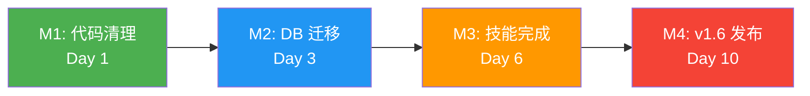
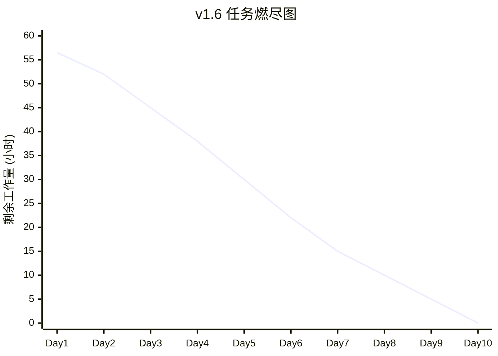

# FeedSales AI MVP v1.6 - 开发任务清单

## 文档信息

| 项目 | 内容 |
|------|------|
| **版本** | v1.6 (OpenClaw Skill 标准版) |
| **创建日期** | 2026-03-27 |
| **状态** | 📋 规划完成，待开发 |
| **总工作量** | 56.5 小时（P0: 22.5h, P1: 18h, P2: 16h） |
| **预计周期** | 10 天（2 周） |
| **关联文档** | [ARCHITECTURE_v1.6.md](./ARCHITECTURE_v1.6.md) |

---

## 1. 任务总览

### 1.1 任务分类

| 优先级 | 任务数 | 工作量 | 完成数 | 状态 |
|--------|-------|-------|-------|------|
| **P0** | 10 | 22.5h | 2 | 🔄 开发中 |
| **P1** | 5 | 18h | 0 | 📋 待开发 |
| **P2** | 6 | 16h | 0 | 📋 待开发 |

### 1.2 里程碑



---

## 2. P0 任务详情（必须完成）

### T01: 修复 Git 远程配置 ✅

**状态**: ✅ 已完成  
**工作量**: 0.5h  
**实际耗时**: 0.5h  
**完成日期**: 2026-03-27  

#### 完成内容

```bash
# 移除错误的远程仓库
git remote remove origin

# 添加正确的 Gitee 仓库
git remote add origin git@gitee.com:kenny-chenym/feed-sales-ai-mvp.git

# 验证配置
git remote -v
```

#### 验收结果

```
origin	git@gitee.com:kenny-chenym/feed-sales-ai-mvp.git (fetch)
origin	git@gitee.com:kenny-chenym/feed-sales-ai-mvp.git (push)
```

---

### T02: 删除 `agent/` 目录 ✅

**状态**: ✅ 已完成  
**工作量**: 0.5h  
**实际耗时**: 0.5h  
**完成日期**: 2026-03-27  

#### 完成内容

```bash
# 删除冗余的 agent 目录
rm -rf agent/

# 验证删除
ls -la | grep agent  # 无输出
```

#### 删除文件

- `agent/handler.py` (15KB, 意图分类器)
- `agent/` 目录

#### 删除理由

OpenClaw Skill 的 `triggers` 配置已足够处理意图路由，无需独立的意图分类器。

---

### T03: 实现 DatabasePool 📋

**状态**: 📋 待开发  
**工作量**: 3h  
**优先级**: P0  
**依赖**: 无  
**预计开始**: 2026-03-28  

#### 任务描述

实现 SQLite 连接池，启用 WAL 模式以支持并发安全。

#### 子任务

| 子任务 | 工作量 | 验收标准 |
|-------|-------|---------|
| 3.1 创建 DatabasePool 类 | 1h | 单例模式，线程安全 |
| 3.2 启用 WAL 模式 | 0.5h | PRAGMA journal_mode=WAL |
| 3.3 实现连接管理 | 1h | get_connection() 上下文管理器 |
| 3.4 单元测试 | 0.5h | 5 个测试用例通过 |

#### 实现步骤

**Step 1: 创建文件**

```bash
mkdir -p src/database
touch src/database/__init__.py
touch src/database/pool.py
```

**Step 2: 实现 DatabasePool**

```python
# src/database/pool.py
import sqlite3
import threading
from contextlib import contextmanager
from pathlib import Path

class DatabasePool:
    """SQLite 连接池（WAL 模式）"""
    
    _instance = None
    _lock = threading.Lock()
    
    def __new__(cls, db_path: str):
        if cls._instance is None:
            with cls._lock:
                if cls._instance is None:
                    cls._instance = super().__new__(cls)
                    cls._instance._initialized = False
        return cls._instance
    
    def __init__(self, db_path: str):
        if self._initialized:
            return
        
        self.db_path = Path(db_path)
        self.db_path.parent.mkdir(parents=True, exist_ok=True)
        self._local = threading.local()
        self._init_db()
        self._initialized = True
    
    def _init_db(self):
        """初始化数据库（WAL 模式）"""
        conn = sqlite3.connect(self.db_path)
        cursor = conn.cursor()
        
        # 启用 WAL 模式
        cursor.execute("PRAGMA journal_mode=WAL")
        cursor.execute("PRAGMA synchronous=NORMAL")
        cursor.execute("PRAGMA cache_size=10000")
        cursor.execute("PRAGMA foreign_keys=ON")
        
        conn.commit()
        conn.close()
    
    @contextmanager
    def get_connection(self):
        """获取数据库连接（线程安全）"""
        conn = sqlite3.connect(self.db_path)
        conn.row_factory = sqlite3.Row
        try:
            yield conn
        finally:
            conn.close()
```

**Step 3: 单元测试**

```python
# tests/unit/test_database_pool.py
import pytest
from src.database.pool import DatabasePool

def test_database_pool_singleton(tmp_path):
    """验证单例模式"""
    db_path = tmp_path / "test.db"
    pool1 = DatabasePool(str(db_path))
    pool2 = DatabasePool(str(db_path))
    assert pool1 is pool2

def test_wal_mode_enabled(tmp_path):
    """验证 WAL 模式启用"""
    db_path = tmp_path / "test.db"
    pool = DatabasePool(str(db_path))
    
    with pool.get_connection() as conn:
        cursor = conn.cursor()
        cursor.execute("PRAGMA journal_mode")
        result = cursor.fetchone()[0]
        assert result == "wal"

def test_get_connection(tmp_path):
    """验证连接管理"""
    db_path = tmp_path / "test.db"
    pool = DatabasePool(str(db_path))
    
    with pool.get_connection() as conn:
        assert conn is not None
        cursor = conn.cursor()
        cursor.execute("SELECT 1")
        result = cursor.fetchone()[0]
        assert result == 1
```

#### 验收标准

- [ ] DatabasePool 类实现完成
- [ ] WAL 模式启用（检查 `-wal` 和 `-shm` 文件）
- [ ] 线程安全验证通过
- [ ] 5 个单元测试全部通过

---

### T04: 实现 Repository 层 📋

**状态**: 📋 待开发  
**工作量**: 4h  
**优先级**: P0  
**依赖**: T03 (DatabasePool)  
**预计开始**: 2026-03-28  

#### 任务描述

实现数据访问层，提供多租户隔离的 CRUD 操作。

#### 子任务

| 子任务 | 工作量 | 验收标准 |
|-------|-------|---------|
| 4.1 FormulaRepository | 1.5h | 配方 CRUD 完整 |
| 4.2 PriceRepository | 1h | 价格 CRUD 完整 |
| 4.3 owner_open_id 过滤 | 1h | 所有查询包含 owner 过滤 |
| 4.4 单元测试 | 0.5h | 10 个测试用例通过 |

#### 实现步骤

参考 [ARCHITECTURE_v1.6.md](./ARCHITECTURE_v1.6.md) 第 4.3 节。

#### 验收标准

- [ ] FormulaRepository 实现完成
- [ ] PriceRepository 实现完成
- [ ] 所有查询包含 `owner_open_id` 过滤
- [ ] 10 个单元测试全部通过

---

### T05: 创建 SQLite Schema 📋

**状态**: 📋 待开发  
**工作量**: 2h  
**优先级**: P0  
**依赖**: 无  
**预计开始**: 2026-03-28  

#### 任务描述

创建完整的数据库 Schema，支持多租户隔离。

#### 子任务

| 子任务 | 工作量 | 验收标准 |
|-------|-------|---------|
| 5.1 创建 schema.sql | 1h | 所有表结构定义 |
| 5.2 创建索引 | 0.5h | 查询优化索引 |
| 5.3 初始化脚本 | 0.5h | init_database.py |

#### 实现步骤

参考 [ARCHITECTURE_v1.6.md](./ARCHITECTURE_v1.6.md) 第 4.1 节。

#### 验收标准

- [ ] schema.sql 文件创建完成
- [ ] 所有表包含 `owner_open_id` 字段
- [ ] 索引优化完成
- [ ] 初始化脚本测试通过

---

### T06: 实现多租户隔离 📋

**状态**: 📋 待开发  
**工作量**: 4h  
**优先级**: P0  
**依赖**: T04 (Repository 层)  
**预计开始**: 2026-03-29  

#### 任务描述

在所有数据库查询中添加 `owner_open_id` 过滤，实现多租户数据隔离。

#### 子任务

| 子任务 | 工作量 | 验收标准 |
|-------|-------|---------|
| 6.1 从 OpenClaw 获取 owner | 1h | context.meta 中提取 |
| 6.2 Repository 层修改 | 1.5h | 所有查询添加 owner 过滤 |
| 6.3 降级策略 | 0.5h | owner 缺失时处理 |
| 6.4 集成测试 | 1h | 多租户隔离验证 |

#### 实现步骤

参考 [ARCHITECTURE_v1.6.md](./ARCHITECTURE_v1.6.md) 第 T04 节。

#### 验收标准

- [ ] 所有 SQL 查询包含 `owner_open_id` 过滤
- [ ] 多租户隔离测试通过
- [ ] owner_open_id 缺失时有降级策略
- [ ] 8 个集成测试全部通过

---

### T07: 配置 OpenClaw Triggers 📋

**状态**: 📋 待开发  
**工作量**: 3h  
**优先级**: P0  
**依赖**: T08 (SKILL.md 完善)  
**预计开始**: 2026-03-30  

#### 任务描述

配置 OpenClaw Skill 的 triggers，替代原有的意图分类器。

#### 子任务

| 子任务 | 工作量 | 验收标准 |
|-------|-------|---------|
| 7.1 编写 skill.yaml frontmatter | 1h | 包含 triggers 配置 |
| 7.2 更新 skill.py 入口 | 1h | 使用 context.intent |
| 7.3 测试触发 | 1h | 关键词触发验证 |

#### 实现步骤

参考 [ARCHITECTURE_v1.6.md](./ARCHITECTURE_v1.6.md) 第 3.3 节。

#### 验收标准

- [ ] 所有 SKILL.md 包含 triggers 配置
- [ ] skill.py 使用 context.intent
- [ ] 关键词触发测试通过

---

### T08: 完善 SKILL.md 格式 📋

**状态**: 📋 待开发  
**工作量**: 2h  
**优先级**: P0  
**依赖**: 无  
**预计开始**: 2026-03-30  

#### 任务描述

按照 OpenClaw 3.24 标准完善所有 SKILL.md 文件。

#### 子任务

| 子任务 | 工作量 | 验收标准 |
|-------|-------|---------|
| 8.1 添加 YAML frontmatter | 1h | name + description + user-invocable |
| 8.2 完善 description | 0.5h | 包含触发关键词 |
| 8.3 添加 metadata.openclaw | 0.5h | 可选：高级配置 |

#### 实现步骤

参考 [ARCHITECTURE_v1.6.md](./ARCHITECTURE_v1.6.md) 第 3.3 节。

#### 验收标准

- [ ] 所有 SKILL.md 包含标准 frontmatter
- [ ] description 包含触发场景
- [ ] user-invocable: true 已添加

---

### T09: 删除 llm_extractor.py 📋

**状态**: 📋 待开发  
**工作量**: 1h  
**优先级**: P0  
**依赖**: 无  
**预计开始**: 2026-03-30  

#### 任务描述

删除自研的 LLM 提取器，改用 OpenClaw 内置 LLM 能力。

#### 子任务

| 子任务 | 工作量 | 验收标准 |
|-------|-------|---------|
| 9.1 删除文件 | 0.5h | llm_extractor.py 删除 |
| 9.2 更新 skill.py 引用 | 0.5h | 使用 OpenClaw 内置 LLM |

#### 实现步骤

参考 [ARCHITECTURE_v1.6.md](./ARCHITECTURE_v1.6.md) 第 T05 节。

#### 验收标准

- [ ] `llm_extractor.py` 文件删除
- [ ] skill.py 中引用已移除
- [ ] 使用 OpenClaw 内置 LLM 调用
- [ ] 功能测试通过

---

### T10: 迁移 JSON 数据到 SQLite 📋

**状态**: 📋 待开发  
**工作量**: 3h  
**优先级**: P0  
**依赖**: T05 (SQLite Schema)  
**预计开始**: 2026-03-31  

#### 任务描述

将历史 JSON 数据迁移到 SQLite 数据库。

#### 子任务

| 子任务 | 工作量 | 验收标准 |
|-------|-------|---------|
| 10.1 创建迁移脚本 | 1.5h | migrate_json_to_sqlite.py |
| 10.2 执行迁移 | 0.5h | 数据导入成功 |
| 10.3 验证数据 | 1h | 数据完整性验证 |

#### 实现步骤

```python
# scripts/migrate_json_to_sqlite.py
import json
import sqlite3
from pathlib import Path

def migrate_formulas(json_path: str, db_path: str):
    """迁移配方数据"""
    with open(json_path, 'r', encoding='utf-8') as f:
        formulas = json.load(f)
    
    conn = sqlite3.connect(db_path)
    cursor = conn.cursor()
    
    for formula_name, ingredients in formulas.items():
        # 插入配方
        cursor.execute("""
            INSERT INTO formulas (owner_open_id, name, stage_type)
            VALUES (?, ?, ?)
        """, ("default_user", formula_name, "unknown"))
        
        formula_id = cursor.lastrowid
        
        # 插入成分
        for ingredient_name, ratio in ingredients.items():
            cursor.execute("""
                INSERT INTO formula_ingredients (formula_id, ingredient_name, ratio_percent)
                VALUES (?, ?, ?)
            """, (formula_id, ingredient_name, ratio))
    
    conn.commit()
    conn.close()
```

#### 验收标准

- [ ] 迁移脚本创建完成
- [ ] 所有 JSON 数据迁移成功
- [ ] 数据完整性验证通过
- [ ] 回滚方案测试通过

---

## 3. P1 任务详情（重要）

### T11: Barchart API 集成 📋

**状态**: 📋 待开发  
**工作量**: 4h  
**优先级**: P1  
**依赖**: 无  
**预计开始**: 2026-04-01  

#### 任务描述

集成 Barchart API 获取实时原料价格。

#### 验收标准

- [ ] Barchart API 客户端实现
- [ ] 价格获取成功
- [ ] 错误处理完善
- [ ] 限流器实现

---

### T12: OpenClaw LLM 测试 📋

**状态**: 📋 待开发  
**工作量**: 2h  
**优先级**: P1  
**依赖**: 无  
**预计开始**: 2026-04-02  

#### 任务描述

测试 OpenClaw 内置 LLM 调用能力。

#### 验收标准

- [ ] LLM 调用成功
- [ ] 响应格式正确
- [ ] 错误处理完善

---

### T13: 错误处理装饰器 📋

**状态**: 📋 待开发  
**工作量**: 2h  
**优先级**: P1  
**依赖**: 无  
**预计开始**: 2026-04-02  

#### 任务描述

实现全局错误处理装饰器。

#### 验收标准

- [ ] 错误装饰器实现
- [ ] 日志记录完善
- [ ] 降级策略实现

---

### T14: Rate Limiter 实现 📋

**状态**: 📋 待开发  
**工作量**: 2h  
**优先级**: P1  
**依赖**: 无  
**预计开始**: 2026-04-03  

#### 任务描述

实现 API 限流器，防止 Barchart API 限流。

#### 验收标准

- [ ] 限流器实现
- [ ] 重试机制实现
- [ ] 测试通过

---

### T15: 补充单元测试 📋

**状态**: 📋 待开发  
**工作量**: 8h  
**优先级**: P1  
**依赖**: T03-T10  
**预计开始**: 2026-04-03  

#### 任务描述

补充所有模块的单元测试。

#### 验收标准

- [ ] 单元测试覆盖率 ≥ 90%
- [ ] 所有测试通过
- [ ] CI/CD 集成

---

## 4. P2 任务详情（文档和测试）

### T16-T21: 文档和测试 📋

| 任务 ID | 任务名称 | 工作量 | 状态 |
|--------|---------|-------|------|
| **T16** | 创建 API.md | 2h | 📋 待开发 |
| **T17** | 创建 DEPLOYMENT.md | 2h | 📋 待开发 |
| **T18** | 创建 USER_GUIDE.md | 2h | 📋 待开发 |
| **T19** | 创建 CHANGELOG.md | 1h | 📋 待开发 |
| **T20** | 集成测试 | 6h | 📋 待开发 |
| **T21** | 性能测试 | 3h | 📋 待开发 |

---

## 5. 任务进度跟踪

### 5.1 燃尽图



### 5.2 每日站会模板

```markdown
## 日期：YYYY-MM-DD

### 昨日完成
- [ ] 任务 ID: 描述

### 今日计划
- [ ] 任务 ID: 描述

### 阻碍
- [ ] 问题描述
```

---

## 6. 变更日志

| 日期 | 版本 | 变更内容 | 作者 |
|------|------|---------|------|
| 2026-03-27 | v1.6.0 | 初始版本 | Kenny Chen |

---

**文档结束**
