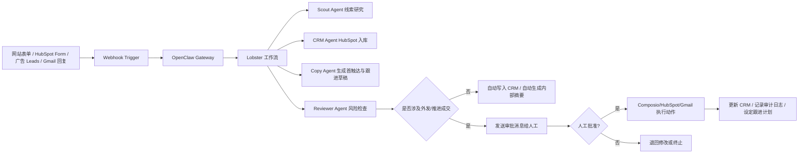

# OpenClaw 饲料销售 AI 助理自动化营销实施蓝图

> 版本：v1.0  
> 适用对象：面向北美饲料销售团队、经销商、营养顾问、牧场/养殖场客户的 AI 营销与售前自动化系统  
> 核心原则：**尽量自动化获客与售前推进，最终外发与成交由人工确认**

---

## 1. 文档目标

本蓝图用于指导你基于 **OpenClaw** 搭建一套可落地的自动化营销系统，使其能够：

1. 自动接收来自网站、广告表单、邮箱、聊天渠道的新线索。
2. 自动完成线索研究、客户画像识别、优先级评分、CRM 入库。
3. 自动生成首轮触达内容、跟进建议、Demo 邀约建议。
4. 自动提醒人工审批关键动作。
5. **所有高风险动作（外发消息、推进成交、报价、合同相关动作）必须人工确认后执行。**

本方案不是“全自动成交机器人”，而是“**营销与售前自动化中枢**”。

---

## 2. 总体策略

### 2.1 你的最佳实践不是“全自动群发”

对于北美 B2B 饲料销售场景，更稳妥的路线是：

- 自动化负责：收集线索、研究客户、更新 CRM、生成草稿、安排节奏、提醒跟进。
- 人工负责：确认是否触达、确认最终文案、确认报价与成交推进。

### 2.2 设计原则

1. **自动化只做低风险、高重复动作。**
2. **所有 side effects 必须有审批门。**
3. **OpenClaw 只拿到完成任务所需的最小权限。**
4. **营销系统按角色分 agent，而不是一个 agent 包办一切。**
5. **先打通 inbound，再扩展 outbound。**
6. **先跑出稳定的 demo 预约流程，再谈更激进的自动化。**

---

## 3. 推荐技术栈

| 层级 | 推荐组件 | 作用 | 是否必选 |
|---|---|---|---|
| Agent 中枢 | OpenClaw | 多渠道接入、工具调用、会话、子代理、自动化调度 | 是 |
| 工作流与审批 | Lobster | 多步骤确定性流程、显式审批点、可恢复执行 | 是 |
| 结构化 LLM 步骤 | LLM Task | 在工作流里输出结构化 JSON，用于评分/分类/摘要 | 强烈建议 |
| 外部 SaaS 连接 | Composio | 统一接入 Gmail、HubSpot、Google Drive 等第三方工具 | 是 |
| CRM | HubSpot | 联系人、公司、Deal、表单、管道管理 | 是 |
| 文案技能 | Cold Outreach / HubSpot skill 等 instruction-only skills | 帮助 OpenClaw 生成更稳定的营销/销售文案与 CRM 操作模式 | 建议 |
| 追踪与可观测性 | Opik | Trace、成本、失败分析 | 建议 |
| 落地页/表单 | HubSpot Forms 或网站表单 | 收集线索 | 是 |
| 预约系统 | HubSpot Meetings / Calendly | 收集 Demo 预约 | 建议 |
| 广告渠道 | Google / LinkedIn / Meta | 引流与收集 inbound leads | 视预算 |

---

## 4. 选择这些组件的原因

- OpenClaw 内置 `browser`、`web_search`、`message`、`cron`、`sessions_*` 等工具，并支持插件扩展，适合做营销运营中枢。  
- Lobster 适合把“调研 → 评分 → 写草稿 → 等审批 → 外发”封装成一个可恢复流程。  
- LLM Task 适合在 Lobster 流程中输出严格结构化结果，例如线索分类、线索评分、下一步建议。  
- Composio 的 OpenClaw 插件可以接入大量第三方 SaaS，能减少你自己写 HubSpot/Gmail/Drive/Sheets 集成的工作量。  
- HubSpot 有现成的 instruction-only skill，适合低风险地让 OpenClaw 学会 CRM 常见操作。  
- ClawHub 上类似 Cold Outreach 的 instruction-only skill 更适合做“方法增强”，不直接扩大 blast radius。  

---

## 5. 目标架构



---

## 6. Agent 分工设计

### 6.1 Scout Agent（线索侦察代理）

**职责：**
- 接收新线索或目标客户名单。
- 使用 OpenClaw 的网页能力查公司官网、业务范围、地理区域、产品线、联系方式、公开信息。
- 根据公开信息判断客户类型。
- 输出结构化画像。

**输入：**
- 姓名、邮箱、公司名、网站、来源渠道、留言内容。

**输出 JSON：**

```json
{
  "persona": "feed_dealer | nutritionist | ranch_owner | farm_operator | unknown",
  "company_type": "dealer | ranch | integrator | feed_mill | consultant | unknown",
  "region": "US-TX",
  "estimated_fit": 78,
  "pain_points": ["lead follow-up", "sales consistency", "quote delay"],
  "evidence": ["public website mentions feed distribution", "has multi-location operation"],
  "recommended_offer": "demo",
  "risk_flags": []
}
```

**可调用工具：**
- `group:web`
- `browser`
- `sessions_*`
- `llm-task`

**不要给它的权限：**
- 不给 `exec`
- 不给外发邮件权限
- 不给 HubSpot 写权限

---

### 6.2 CRM Agent（CRM 入库代理）

**职责：**
- 在 HubSpot 建立或更新 contact、company、deal。
- 补充自定义字段。
- 记录来源与画像标签。
- 避免重复创建。

**输入：**
- Scout Agent 输出的结构化画像。
- 原始线索字段。

**输出：**
- `contact_id`
- `company_id`
- `deal_id`（如适用）
- 是否新建 / 更新
- 下一个 pipeline stage

**推荐接法：**
1. 首选：Composio HubSpot 连接器。  
2. 备选：ClawHub 的 HubSpot instruction-only skill + API Token。

**可调用工具：**
- Composio HubSpot 工具
- `llm-task`

**不要给它的权限：**
- 不允许直接外发邮件
- 不允许自动推进到 Closed Won

---

### 6.3 Copy Agent（文案与触达代理）

**职责：**
- 生成首轮触达邮件草稿。
- 生成 Demo 邀约文案。
- 生成 2~3 轮跟进草稿。
- 针对不同 persona 生成不同版本。

**输出示例：**

```json
{
  "primary_email_subject": "Help your feed sales team follow up faster",
  "primary_email_body": "...",
  "follow_up_1": "...",
  "follow_up_2": "...",
  "linkedin_dm": "...",
  "cta": "Book a 20-minute demo"
}
```

**建议加载的 skill：**
- Cold Outreach
- HubSpot
- 你自己的行业知识 skill（饲料行业、牧场销售流程、产品 ROI）

**注意：**
- 只负责起草，不负责自动发送。
- 所有输出必须引用线索画像中的证据点，不允许凭空臆测。

---

### 6.4 Reviewer Agent（审查代理）

**职责：**
- 检查文案是否存在过度承诺。
- 检查是否引用了未核实信息。
- 检查是否语气过重、过长、太销售导向。
- 检查是否违反你的人工审批规则。

**建议输出：**

```json
{
  "approved_for_human_review": true,
  "risk_level": "low",
  "issues": [],
  "rewrite_required": false,
  "recommended_send_channel": "email"
}
```

---

### 6.5 Closer Assist Agent（成交辅助代理）

**职责：**
- 给人工汇总关键线索。
- 给出推荐动作。
- 在人工确认后执行“最终发送”或“安排 Demo”。
- 成交后更新 CRM 和复盘信息。

**高风险动作必须人工确认：**
- 首封外发邮件
- LinkedIn 私信
- WhatsApp / Telegram / 短信触达
- 推进报价 / 合同阶段
- 修改 deal 金额和 close date

---

## 7. 关键技能与插件清单

### 7.1 必装

1. **Lobster**  
   用于构建带审批点的多步骤营销工作流。

2. **LLM Task**  
   用于输出结构化评分、分类、建议，不再依赖松散自然语言。

3. **Composio Plugin for OpenClaw**  
   用于 Gmail / HubSpot / Google Drive / 其他 SaaS 接入。

4. **HubSpot skill（instruction-only）**  
   作为 CRM 操作参考手册和兜底能力。

### 7.2 建议安装的 instruction-only skills

1. **Cold Outreach**  
   用于多触点外联节奏和个性化邮件框架。

2. **你自己的行业 skill**  
   建议你做一个私有 skill，内容包括：
   - 饲料销售流程
   - 经销商常见痛点
   - 牧场客户典型问题
   - 你的产品价值点
   - 禁止夸大的说法
   - Demo 预约话术

### 7.3 暂不建议上生产的高风险能力

- 自动化社媒批量操作 skill
- 自动批量外发 DM / connection request 的 browser skill
- 未经验证的“全自动 CRM / 全自动 outreach”第三方 skill
- 会请求大量凭据或允许任意浏览器持久登录的技能包

---

## 8. HubSpot 数据模型设计

### 8.1 Contact 自定义字段建议

| 字段 | 类型 | 说明 |
|---|---|---|
| `persona` | 单选 | `feed_dealer / nutritionist / ranch_owner / farm_operator / unknown` |
| `lead_source_detail` | 文本 | Google Ads / LinkedIn / Website / Referral / Email Reply |
| `ai_fit_score` | 数字 | 0-100 |
| `ai_pain_points` | 多行文本 | AI 提取的关键痛点 |
| `ai_last_summary` | 多行文本 | 最近一次 AI 摘要 |
| `ai_next_best_action` | 单选 | demo_invite / nurture / qualify / disqualify |
| `ai_risk_flags` | 多行文本 | 风险点 |
| `preferred_channel` | 单选 | email / phone / linkedin / whatsapp |
| `territory_hint` | 单选 | 州/省或销售区域 |

### 8.2 Company 字段建议

| 字段 | 类型 | 说明 |
|---|---|---|
| `company_type` | 单选 | dealer / ranch / feed_mill / consultant / integrator |
| `livestock_focus` | 单选 | cattle / dairy / swine / poultry / mixed / unknown |
| `estimated_team_size` | 文本 | AI 估算或手工补充 |
| `estimated_locations` | 数字 | 估算直营网点数 |
| `ai_company_summary` | 多行文本 | AI 摘要 |
| `ai_use_case_fit` | 多行文本 | 适用场景 |

### 8.3 Deal 管道建议

建议管道：

1. `New Lead`
2. `AI Researched`
3. `Human Review Pending`
4. `First Outreach Sent`
5. `Qualified`
6. `Demo Scheduled`
7. `Proposal / Pilot`
8. `Closed Won`
9. `Closed Lost`

**规则：**
- `Human Review Pending` 之前可以自动流转。
- `First Outreach Sent` 开始必须有人工审批记录。
- `Proposal / Pilot` 之后只允许人工推进。

---

## 9. 自动化流程蓝图

### 9.1 Inbound Lead 流程（优先上线）

**触发源：**
- 网站表单
- HubSpot 表单
- Google / LinkedIn / Meta lead form
- Gmail 收到主动咨询

**流程：**
1. Webhook 将线索 payload 发给 OpenClaw。
2. Lobster 启动 `lead_intake_and_qualification` 流程。
3. Scout Agent 做线索研究与分类。
4. CRM Agent 查重并写入 HubSpot。
5. Copy Agent 生成首轮邮件 / Demo 邀约草稿。
6. Reviewer Agent 做风险检查。
7. 若只是内部摘要，则自动发给你。
8. 若需要外发，则进入审批。
9. 你批准后，执行发送并更新 Deal Stage。
10. 设定下一次跟进提醒。

---

### 9.2 Outbound Account List 流程（第二阶段）

**触发源：**
- 你提供目标公司名单。
- 每周行业调研新增目标名单。

**流程：**
1. OpenClaw 读取名单。
2. Scout Agent 补全网站、业务、地区、画像。
3. LLM Task 计算适配度评分。
4. 按阈值分组：
   - A 类：高优先级，建议人工尽快触达
   - B 类：进入培育
   - C 类：暂不触达
5. Copy Agent 为 A 类生成首触达草稿。
6. Human Review 后再发送。

---

### 9.3 Reply Handling 流程（非常重要）

**触发源：**
- Gmail 新回复
- HubSpot Conversation / inbox 新消息

**流程：**
1. 触发 OpenClaw。
2. Summarize 回复意图：有兴趣 / 无兴趣 / 需要报价 / 需要案例 / 要求联系销售 / 取消联系。
3. 更新 CRM 状态。
4. 生成建议动作：
   - 发送 case study
   - 预约 demo
   - 暂停打扰
   - 转人工销售
5. 所有回复消息草稿继续走审批。

---

## 10. Lobster 审批流设计

### 10.1 你需要的审批原则

以下动作一律中断等待批准：

- 发首封邮件
- 发跟进邮件
- 发 LinkedIn / WhatsApp / Telegram 消息
- 把 deal 推进到 `Qualified` 之后的阶段
- 写任何带有价格、承诺 ROI、合同语义的内容

### 10.2 推荐工作流名称

- `lead_intake_and_qualification`
- `draft_first_outreach`
- `reply_analysis_and_recommendation`
- `schedule_follow_up_review`
- `demo_prep_summary`

### 10.3 Lobster 工作流伪代码

```yaml
workflow: lead_intake_and_qualification
inputs:
  - lead_payload
steps:
  - id: normalize_input
    type: llm-task
    output_schema: LeadNormalized

  - id: research_company
    type: scout_agent

  - id: score_lead
    type: llm-task
    output_schema: LeadScoreCard

  - id: upsert_hubspot
    type: composio_hubspot

  - id: draft_outreach
    type: copy_agent

  - id: review_risk
    type: reviewer_agent

  - id: approval_gate
    type: approval
    when: review_risk.requires_human_approval == true

  - id: send_message
    type: composio_gmail
    when: approval_gate.approved == true

  - id: update_stage
    type: composio_hubspot

  - id: schedule_follow_up
    type: cron
```

---

## 11. OpenClaw 工具权限策略

### 11.1 总原则

不要给所有 agent 默认 `full` 工具权限。

### 11.2 推荐权限分配

| Agent | 建议权限 |
|---|---|
| Scout | `group:web`, `browser`, `group:sessions`, `llm-task` |
| CRM | Composio HubSpot, `llm-task` |
| Copy | `llm-task`, 只读 CRM 查询 |
| Reviewer | `llm-task` |
| Closer Assist | `message`, Composio Gmail/HubSpot, `cron` |

### 11.3 明确禁止

- 默认不给 `exec`
- 默认不给 `group:fs`
- 默认不给任意插件工具的通配式放开
- 默认不给浏览器持久登录多个生产账号
- 默认不给共享网关上的多人共同驱动同一个高权限 agent

---

## 12. Webhook 与调度设计

### 12.1 Webhook 入口

用于接收：
- 表单提交
- 广告 leads
- Gmail 新邮件通知
- HubSpot 新事件

### 12.2 Webhook 安全要求

必须遵守：

- webhook 端点放在 loopback、tailnet 或可信反向代理后面
- 单独使用 hook token，不复用 gateway token
- 限制允许的 `agentId`
- 默认不要允许外部请求自定义 `sessionKey`

### 12.3 调度建议

**Cron 用于：**
- 每天 08:00 汇总新线索
- 每天下午检查待审批草稿
- 每周生成营销漏斗汇总
- 定时回看未回复线索

**Heartbeat 用于：**
- 主会话里做轻量巡检
- 检查 Gmail / 日程 / 通知类日常事项

**原则：**
- 精确定时任务用 Cron
- 需要主会话上下文的日常巡视用 Heartbeat

---

## 13. 线索评分模型

建议初始评分公式：

```text
总分 = 角色匹配(0-25)
     + 公司匹配(0-20)
     + 场景痛点匹配(0-20)
     + 互动意图强度(0-15)
     + 地域/市场匹配(0-10)
     + 数据完整度(0-10)
```

### 13.1 评分区间

| 分数 | 处理策略 |
|---|---|
| 80-100 | 高优先级，24 小时内人工确认触达 |
| 60-79 | 进入标准 nurture 流程 |
| 40-59 | 继续观察，补资料 |
| < 40 | 暂不触达，归档或低频培育 |

### 13.2 负面扣分项

- 邮箱明显无效
- 公司无官网或公开信息不足
- 行业不匹配
- 联系意图非常弱
- 明显是学生/求职/供应商而非目标客户

---

## 14. 文案策略

### 14.1 你的首封邮件目标不是卖掉，而是推进到下一个动作

首封邮件的目标通常只有三个：

1. 确认是否相关
2. 获取 15~20 分钟 Demo
3. 获取合适的转介绍联系人

### 14.2 推荐文案框架

**框架 A：问题切入**
- 你们现在是否存在销售线索跟进慢、报价响应不一致的问题？
- 我们做了一个面向饲料销售场景的 AI 助理，帮助团队更快跟进和标准化销售动作。
- 如果你愿意，我可以发一页简短说明，或者安排一个 20 分钟演示。

**框架 B：角色切入**
- 给 feed sales manager / dealer owner / nutrition consultant 分别使用不同版本。

**框架 C：案例切入**
- 只在你有真实案例后再启用。

### 14.3 禁止内容

- 不要承诺固定 ROI
- 不要承诺“完全自动成交”
- 不要臆测客户业务规模
- 不要写过长的教育型长邮件作为首触达

---

## 15. 人工审批消息模板

建议 OpenClaw 给你发送固定格式摘要：

```markdown
## 待审批线索
- 姓名：{{name}}
- 公司：{{company}}
- Persona：{{persona}}
- 来源：{{lead_source}}
- Fit Score：{{score}}
- 推荐动作：{{next_best_action}}

### AI 摘要
{{summary}}

### 拟发送主题
{{subject}}

### 拟发送正文
{{body}}

### 风险提示
{{risk_flags}}

### 快捷指令
- 批准发送
- 修改后发送
- 仅保存到 CRM
- 终止
```

---

## 16. 关键实施顺序

### 阶段 1：最小可用版本（先上线）

目标：**收线索 → 自动研究 → CRM 入库 → 生成草稿 → 人工审批发送**

交付项：
1. OpenClaw 安装完成
2. Lobster 启用
3. LLM Task 启用
4. Composio 接入 HubSpot + Gmail
5. 建立一个 inbound webhook
6. HubSpot 自定义字段创建完成
7. 实现一个 `lead_intake_and_qualification` 流程
8. Telegram/WhatsApp/你常用渠道收到待审批通知

### 阶段 2：稳定化

目标：**形成可复用流程和指标闭环**

交付项：
1. 增加 reply handling
2. 增加 follow-up cron
3. 增加 weekly funnel report
4. 增加文案版本 A/B 标签
5. 加入 Opik trace

### 阶段 3：内容与外联扩展

目标：**做 outbound 和内容运营自动化**

交付项：
1. 批量目标名单研究
2. Lead magnet / case study 自动整理
3. Demo 前自动生成 account brief
4. Lost deal 复盘摘要

---

## 17. 你需要自己补的一层：行业专属私有 Skill

这是成败关键。

建议你单独做一个私有 skill，名字可以是：

- `feed-sales-gtm`
- `ranch-buyer-personas`
- `feed-ai-product-positioning`

内容建议包括：

1. 目标客户画像
2. 常见痛点库
3. 价值点映射
4. 禁止表述
5. 产品定位与差异化
6. Demo 常见问题
7. 资格审查问题清单
8. 北美场景术语表

这样 Copy Agent 和 Reviewer Agent 才不会一直输出“泛 SaaS 销售文案”。

---

## 18. 监控指标

### 18.1 营销漏斗指标

- 新线索数
- AI 研究完成率
- 人工审批通过率
- 首触达发送率
- 回复率
- Demo 预约率
- Qualified 率
- Proposal / Pilot 转化率
- Closed Won 率

### 18.2 AI 质量指标

- 文案被人工改写比例
- 画像判断错误率
- 评分偏差率
- CRM 重复创建率
- 误发风险事件数
- 每条线索处理成本

---

## 19. 安全与运维要求

### 19.1 OpenClaw 部署边界

不要把多个互不信任的人放在同一个高权限 gateway 上共同驱动同一个 agent。

### 19.2 最小权限

- 按 agent 发不同 token / 连接权限
- 将外发权限集中在 Closer Assist Agent
- 其他 agent 默认只读或半只读

### 19.3 审计

至少记录：
- 谁批准了发送
- 发送了什么内容
- 更新时间与对象
- Deal stage 变化
- 失败原因

### 19.4 失败兜底

以下情况必须中止自动化并通知人工：
- HubSpot 查重失败
- 线索评分置信度过低
- 文案存在高风险词
- 连接器认证失效
- 连续 2 次发送失败

---

## 20. 你现在最该做的最小版本

如果你现在就要开始，不要一次做太大。最小版本只做下面这条链：

```text
网站/表单线索进入
→ OpenClaw webhook 触发
→ Scout Agent 调研
→ CRM Agent 写入 HubSpot
→ Copy Agent 生成首触达草稿
→ Reviewer Agent 审查
→ 发送审批消息给你
→ 你批准后才发邮件
→ CRM 更新阶段并设跟进提醒
```

只要这条链跑通，你就已经不是“手工营销”，而是进入“AI 辅助营销运营”阶段了。

---

## 21. 推荐的下一步实施任务清单

### 立即做

1. 安装并启用 OpenClaw
2. 安装 Lobster、LLM Task、Composio
3. 接通 HubSpot 与 Gmail
4. 创建 HubSpot 自定义字段
5. 建一个 inbound 表单 webhook
6. 写出第一版 `lead_intake_and_qualification` Lobster 流程
7. 定义审批消息模板
8. 建立 3 套首触达模板：dealer / ranch / nutritionist

### 一周内完成

1. 增加 reply handling
2. 增加 follow-up cron
3. 增加周报
4. 加入 Opik
5. 做私有行业 skill

---

## 22. 参考来源

以下来源用于支撑本蓝图的产品能力判断与实施建议：

### OpenClaw 官方文档
- OpenClaw 首页：<https://docs.openclaw.ai/>
- Tools and Plugins：<https://docs.openclaw.ai/tools>
- Lobster：<https://docs.openclaw.ai/tools/lobster>
- LLM Task：<https://docs.openclaw.ai/tools/llm-task>
- Webhook / Cron / Automation：<https://docs.openclaw.ai/automation/cron-jobs>
- Cron vs Heartbeat：<https://docs.openclaw.ai/automation/cron-vs-heartbeat>
- Gateway Security：<https://docs.openclaw.ai/gateway/security>
- CLI Security：<https://docs.openclaw.ai/cli/security>
- Plugin Architecture：<https://docs.openclaw.ai/plugins/architecture>

### 插件 / Skill / 集成
- Composio OpenClaw Plugin：<https://github.com/ComposioHQ/openclaw-composio-plugin>
- HubSpot Skill（ClawHub）：<https://clawhub.ai/kwall1/hubspot>
- Cold Outreach Skill（ClawHub）：<https://clawhub.ai/staybased/cold-outreach>

---

## 23. 结论

这套方案的核心不是“让 OpenClaw 代替销售”，而是：

> **让 OpenClaw 代替你做 80% 重复、低风险、耗时的营销与售前准备工作，把高风险与高价值的决策保留给人。**

你真正要搭建的，不是一个会乱发消息的 agent，而是一个：

- 会接线索
- 会查资料
- 会写草稿
- 会更新 CRM
- 会提醒你审批
- 会追踪后续动作
- 但不会擅自成交

的营销自动化中枢。

